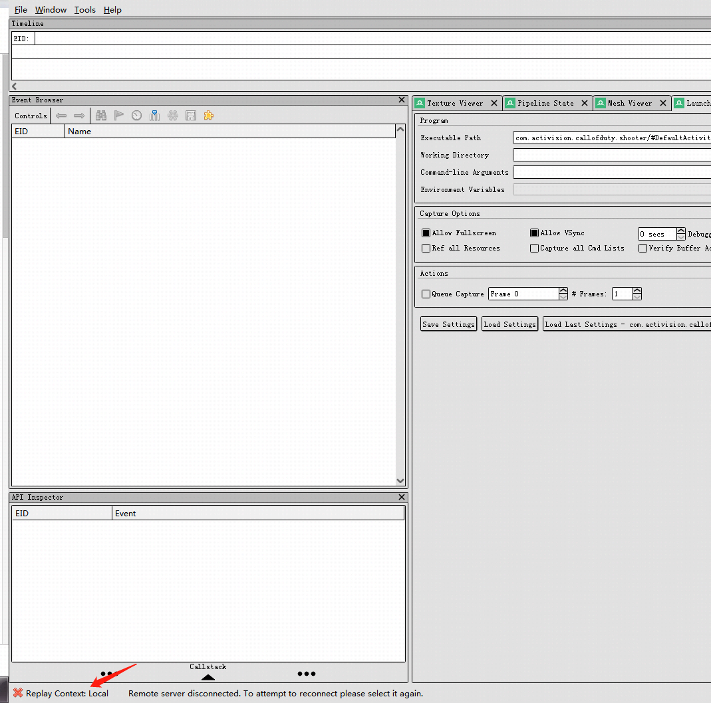

# RenderDoc

## renderdoc

 [https://renderdoc.org/docs/how/how\_android\_capture.html](https://renderdoc.org/docs/how/how_android_capture.html)  
1 使用android studio下载手机对应版本的android sdk  
2 使用android studio 下载对应的google usb driver，并手动从本地文件安装驱动  
3 使用 sdk里的platform-tools的adb.exe, cmd指令:adb devices判断是否连接上手机  
4 关闭所有会阻碍连接的应用，包括电脑管家，proxy, 微信等  
5 switch render doc,replay context to phone  
6 从 launch application 文件浏览栏浏览手机文件apk,并启动  
7 就可以调试了  
8 如果出现程序无法启动的问题，1\)确认所有电脑端干扰程序关闭  
2）确认手机调试权限全部开启，文件\(数据\)传输格式，有可能android 8版本不行，需要android 9才行  
9 如果总是启动不了，可以反复拔插usb线，就可以正确截帧了  
  
renderdoc：unity编辑器安装与使用  
[https://gameinstitute.qq.com/community/detail/126627](https://gameinstitute.qq.com/community/detail/126627)  
pc编辑器版可以看pixel history, debug pixel,手机端不行，如果编辑器启动loadrenderdoc失败，可以使用rendoc启动unity然后那个捕捉的图标就可以显示了  
RenderDoc可以方便导出mesh, texture数据从而对游戏进行破解，本身是开源的，[https://renderdoc.org/docs/python\_api/index.html](https://renderdoc.org/docs/python_api/index.html)

