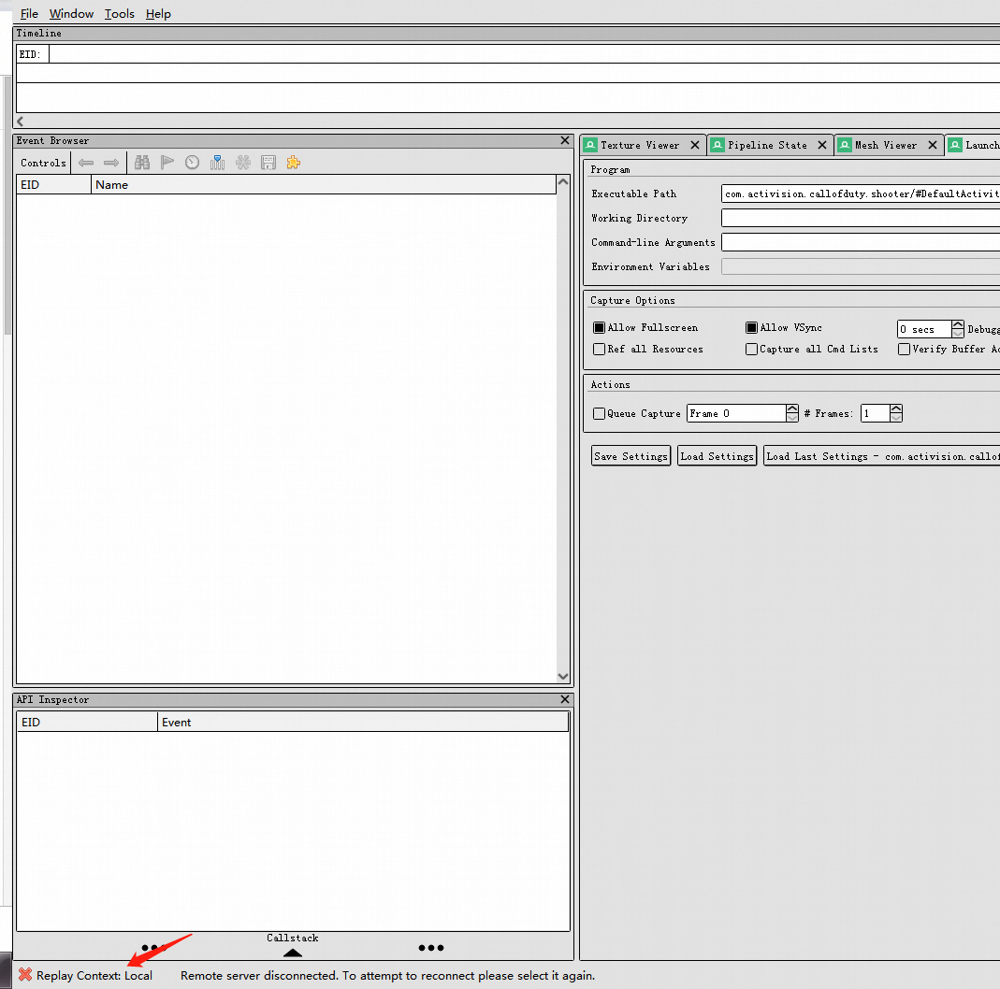

# RenderDoc

## renderdoc

可以调试debug, release包， 可以直接保存截帧文件.rdc，可以在本地使用local pc硬件replay，也可以使用remote devices\(手机\) replay

 [https://renderdoc.org/docs/how/how\_android\_capture.html](https://renderdoc.org/docs/how/how_android_capture.html)  
1 使用android studio下载手机对应版本的android sdk  
2 使用android studio 下载对应的google usb driver，并手动从本地文件安装驱动  
3 使用 sdk里的platform-tools的adb.exe, cmd指令:adb devices判断是否连接上手机  
4 关闭所有会阻碍连接的应用，包括电脑管家，proxy, 微信等  
5 switch render doc,replay context to phone  
6 从 launch application 文件浏览栏浏览手机文件apk,并启动  
7 就可以调试了  
8 如果出现程序无法启动的问题，1\)确认所有电脑端干扰程序关闭  
2）确认手机调试权限全部开启，文件\(数据\)传输格式，有可能android 8版本不行，需要android 9才行  
9 如果总是启动不了，可以反复拔插usb线，就可以正确截帧了  
  
renderdoc：unity编辑器安装与使用

[https://docs.unity3d.com/Manual/RenderDocIntegration.htm](https://docs.unity3d.com/Manual/RenderDocIntegration.html)  
[https://gameinstitute.qq.com/community/detail/126627](https://gameinstitute.qq.com/community/detail/126627)  
pc编辑器版可以看pixel history, debug pixel,手机端不行，如果编辑器启动loadrenderdoc失败，可以使用rendoc启动unity然后那个捕捉的图标就可以显示了  
RenderDoc可以方便导出mesh, texture数据从而对游戏进行破解，本身是开源的，[https://renderdoc.org/docs/python\_api/index.html](https://renderdoc.org/docs/python_api/index.html)

**apk准备**

1. 准备好需要调试的apk
   * Q飞-蓝盾流水线下载：[http://devops.oa.com/console/pipeline/speedmobile/pe12bc348783641c7aee6a56cd2747f72/history](http://devops.oa.com/console/pipeline/speedmobile/pe12bc348783641c7aee6a56cd2747f72/history)  

     在“查看构件”中下载生成好的apk包
2. pc端安装abd工具
   * 下载 `\\tencent.com\tfs\跨部门项目\QQ飞车手游\构建归档\BuildTools\Windows` 文件目录下的 `android_sdk` 
     * `adb.exe` 在 `\android_sdk\android_sdk\platform-tools` 下，需要将相应路径添加到系统变量的Path中，才可使用adb命令。
3. 通过pc对手机进行apk包的安装
   * win+r，输入cmd，打开“命令提示符”窗口
   * adb devices 检查手机和电脑是否成功连接
   * adb install -r（将apk安装包直接拖进cmd里的光标位置即可），点击回车键
   * 在手机上点击“允许安装应用”

**RenderDoc连接手机**

1. 此时还可能出现下图Warning，点击确认修复，修复会repatch apk 

1. 安卓手机上会出现弹框，点击“继续安装”。
2. 安装成功后，点击“Launch”，就可以成功连接手机。接下来就可对apk包进行截帧分析了。

> 如果遇到签名问题，可使用本项目中优化签名后的Renderdoc。 **使用方法：**在 `\android_sdk\android_sdk\platform-tools` 目录下创建 `KeyStore` 文件夹，并放入xxx.keystore 文件，以及存放对应密码的xxx.txt 文件。就可用指定的证书文件对apk进行签名。 如果找不到该文件夹，用户未指定签名证书的话，则会直接使用Renderdoc的自签名。

